<!--
  This is your PROFILE README. It goes in a repo named exactly after your
  username (e.g. github.com/OCTOCAT/OCTOCAT) so GitHub shows it on your profile.
  Replace the ALL-CAPS placeholders. Widths 370/490 keep the portrait and info
  card the same height -- if you change the info card's H, re-match these.
-->

<table>
<tr>
<td valign="top"></td>
<td valign="top"></td>
</tr>
</table>

<!-- ======================= INTRO ======================= -->

<h1 align="center">Hey there, I'm RISHAV SINGH 👋</h1>

  

  
  
  

 

<!-- ======================= ABOUT ME ======================= -->

<h2 align="center">⚡ About Me</h2>

<table align="center">
<tr>
<td width="65%" valign="top">

### Hey! I'm Rishav 👨‍💻

I am a **Computer Science Engineering student** at **ITER, SOA University**, passionate about building scalable digital products, intelligent AI systems, and enterprise-grade full stack applications.

- 🚀 Building scalable **AI Systems, Computer Vision & Full Stack Applications**
- 🧠 Developing with **PyTorch, TensorFlow, OpenCV & Deep Learning Pipelines**
- ⚡ Engineering full stack solutions with **React, Next.js, Node.js, FastAPI & Django**
- ☁️ Designing **Real-Time Architectures, Dockerized Deployments & AWS Cloud**
- 🏆 **2nd Prize Winner @ OITS 2025** for *Cyber Sentinel CCTV AI Platform*
- 🛠️ Industrial AI Experience in steel defect detection @ **Tata Steel**
- 🧠 Practicing **DSA, System Design & Problem Solving**
- 🎯 Open to **Software Engineering & AI/ML Roles / Internships**

 

> **"Engineering intelligent, scalable systems with precision and purpose."**

</td>

<td width="35%" align="center" valign="middle">

  

 

 

</td>
</tr>
</table>

 

<!-- ======================= TECH STACK ======================= -->

<h2 align="center">🧰 Tech Stack</h2>

  

  

  

  

 

<!-- ======================= CURRENTLY ======================= -->

<h2 align="center">🌱 Currently Exploring</h2>

  
  
  
  
  

 

<!-- ======================= FEATURED PROJECTS ======================= -->

<h2 align="center">🚀 Featured Projects</h2>

<b>Cyber Sentinel — A CCTV Surveillance Platform (🏆 OITS 2nd Prize 2025)</b>

### AI-powered real-time CCTV surveillance dashboard with Live Alerts and intelligent threat analysis.

| Category | Details |
|---|---|
| Stack | React, Node.js, WebSockets, AI Detection |
| Scale | Real-time CCTV monitoring |
| Performance | Live Alerts & video rendering |
| Security | Secure communication architecture |
| Impact | Intelligent surveillance & threat monitoring |
| Repository | [View Project](https://github.com/rishav-1306) |

Cyber Sentinel is an advanced CCTV monitoring platform designed for real-time CCTV operations with live Intrusions, surveillance dashboards, and threat detection systems for command-center level analytics.

<b>EmbryoGen — AI-Assisted Embryo Analysis System</b>

### AI-powered embryo classification and monitoring platform supporting assisted reproductive technology workflows.

| Category | Details |
|---|---|
| Stack | Python, AI/ML, Visualization Systems |
| Scale | Biological image analysis |
| Performance | Optimized embryo classification pipelines |
| Security | Secure data monitoring workflows |
| Impact | Decision-support for reproductive analysis |
| Repository | [View Project](https://github.com/rishav-1306) |

EmbryoGen leverages AI-assisted embryo analysis techniques combined with intelligent visualization systems to support monitoring and classification workflows in assisted reproductive technology.

<b>DefectForge AI — Steel Surface Defect Detection</b>

### Enterprise-grade AI computer vision platform for industrial steel defect detection and automated quality inspection.

| Category | Details |
|---|---|
| Stack | Python, TensorFlow, PyTorch, OpenCV |
| Scale | Industrial manufacturing analytics |
| Performance | Real-time defect classification |
| Security | Production-focused AI pipelines |
| Impact | Automated quality control optimization |
| Repository | [View Project](https://github.com/rishav-1306) |

DefectForge AI uses deep learning and computer vision pipelines to detect and classify manufacturing defects in steel sheets, significantly reducing manual inspection overhead and improving production accuracy.

<b>Real-Time Collaboration Suite</b>

### Full stack collaboration platform enabling simultaneous communication and synchronized workflows.

| Category | Details |
|---|---|
| Stack | MERN Stack, Socket.IO, MongoDB |
| Scale | Multi-user concurrent communication |
| Performance | Low-latency real-time synchronization |
| Security | JWT authentication & protected APIs |
| Impact | Scalable collaborative productivity |
| Repository | [View Project](https://github.com/rishav-1306) |

Built with scalable WebSocket infrastructure and modern frontend systems to deliver responsive real-time collaboration experiences with secure backend architecture.

 

<!-- ======================= CODING PROFILES ======================= -->

<h2 align="center">💻 Coding Profiles</h2>

  
  
  
  

 

<!-- ======================= GITHUB ANALYTICS ======================= -->

<h2 align="center">📊 GitHub Analytics</h2>

  
  

 

<!-- ======================= GITHUB STREAK ======================= -->

<h2 align="center">🔥 GitHub Streak</h2>

  

 

<!-- ======================= CONTRIBUTION ACTIVITY ======================= -->

<h2 align="center">📈 Contribution Activity</h2>

  

 

<!-- ======================= CONTRIBUTION SNAKE ======================= -->

<h2 align="center">🐍 Contribution Snake</h2>

  <picture>
    <source media="(prefers-color-scheme: dark)" srcset="https://raw.githubusercontent.com/rishav-1306/rishav-1306/output/github-contribution-grid-snake-dark.svg">
    <source media="(prefers-color-scheme: light)" srcset="https://raw.githubusercontent.com/rishav-1306/rishav-1306/output/github-contribution-grid-snake.svg">
    
  </picture>

 

<!-- ======================= CONNECT ======================= -->

<h2 align="center">🤝 Let's Connect</h2>

  
  
  
  

 

  <i>"Engineering scalable AI systems and modern software products with performance, precision, and innovation."</i>

 

<!-- ======================= FOOTER ======================= -->

  

